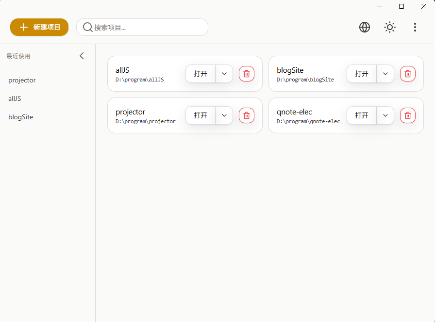
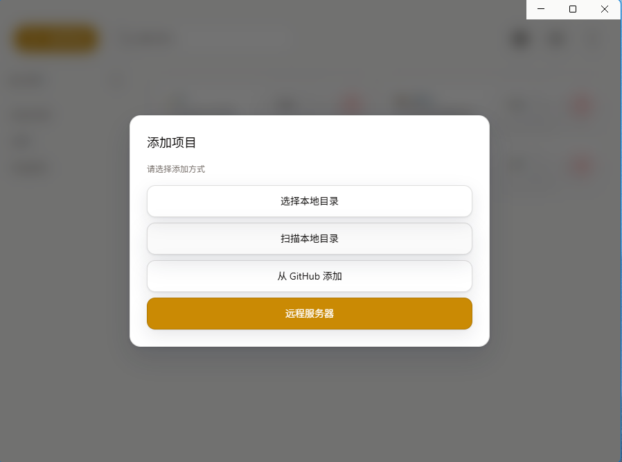

# Projector

一个优雅的 Electron 项目启动器和管理工具，帮助你快速管理和打开开发项目。


[English Documentation](./README_EN.md)

## 🤔 解决了什么问题？

作为开发者，你是否也经常遇到这些烦恼？

- **项目切换繁琐**：手头同时负责多个项目，在它们之间频繁切换时，每次都要打开 IDE -> Open Folder -> 寻找路径，步骤重复且繁琐。
- **项目遗忘**：源代码分散在磁盘的不同角落（`~/work`, `~/personal`, `D:\github`...），时间久了容易忘记某些项目的具体位置。
- **环境割裂**：有的项目适合用 VS Code，有的想用 Cursor；有的在本地，有的在远程服务器（SSH），缺乏一个统一的入口来管理。
- **效率损耗**：每天开始工作前，都要凭记忆重新打开昨天的一堆窗口。

**Projector** 为此而生。它提供了一个优雅、统一的"指挥中心"，帮你聚合管理所有的本地和远程项目。无论它们在哪里，都能**一键极速唤起**，让你的开发环境瞬间就绪。

## ✨ 特性

### 🎯 核心功能

- **项目管理**：轻松添加、管理和删除项目记录
- **智能检测**：自动识别项目类型并匹配对应的 IDE（Cursor / VS Code）
- **快速打开**：一键打开项目，支持自定义默认编辑器
- **最近打开**：侧边栏显示最近打开的项目，快速访问
- **批量扫描**：扫描整个目录，自动发现所有项目
- **GitHub 集成**：直接从 GitHub 克隆公开仓库
- **SSH 远程支持**：配置 SSH 远程主机，轻松连接并管理远程项目

### 🎨 用户体验

- **亮暗色主题**：支持亮色和暗色主题切换，保护你的眼睛
- **多语言支持**：内置中英文切换，满足不同语言需求
- **批量操作**：支持批量选择、删除项目，管理更高效
- **优雅动画**：流畅的界面动画，提升使用体验
- **响应式设计**：适配不同屏幕尺寸
- **搜索功能**：快速搜索项目名称、路径和描述
- **可折叠侧边栏**：自定义界面布局，节省空间

### 🛠️ 技术特性

- **跨平台**：支持 Windows、macOS 和 Linux
- **现代化 UI**：基于 Vue 3 和现代 CSS 设计
- **类型安全**：完整的 TypeScript 支持
- **高性能**：基于 Electron 和 Vite 构建

## 📸 截图

### 主界面（亮色主题）
<div align="center">
  
</div>

### 添加项目
<div align="center">
  
</div>

## 🚀 快速开始

### 环境要求

- Node.js >= 18
- npm 或 yarn

### 安装

```bash
# 克隆仓库
git clone <repository-url>
cd projector

# 安装依赖
yarn install
# 或
npm install
```

### 开发

```bash
# 启动开发服务器
yarn dev
# 或
npm run dev
```

### 构建

```bash
# 构建应用（不打包）
yarn build

# 构建 Windows 版本
yarn build:win

# 构建 macOS 版本
yarn build:mac

# 构建 Linux 版本
yarn build:linux
```

## 📖 使用指南

### 添加项目

1. **添加本地项目**
   - 点击工具栏的"添加项目"按钮
   - 选择项目目录
   - 应用会自动检测项目类型并设置默认 IDE

2. **添加 SSH 远程项目**
   - 点击"添加项目" → "SSH 远程连接"
   - 输入 SSH 连接信息（主机、端口、用户等）或选择现有 SSH 配置
   - 连接成功后浏览并选择远程目录添加为项目

3. **从 GitHub 添加**
   - 点击"添加项目" → "从 GitHub 添加"
   - 输入 GitHub 仓库的 HTTPS 地址
   - 选择克隆到的父目录
   - 点击"开始拉取"，等待克隆完成

4. **批量扫描**
   - 点击工具栏的"扫描目录"按钮
   - 选择包含多个项目的父目录
   - 应用会自动发现所有项目并添加到列表

### 打开项目

- **快速打开**：点击项目卡片上的"打开"按钮，使用默认 IDE 打开
- **选择 IDE**：点击"打开"按钮旁边的下拉箭头，选择其他 IDE
- **最近打开**：在左侧侧边栏点击最近打开的项目，快速访问

### 管理项目

- **搜索项目**：在顶部搜索框输入关键词，实时过滤项目列表
- **删除项目**：点击项目卡片上的删除按钮（仅删除应用内记录，不会删除磁盘文件）
- **设置默认 IDE**：在下拉菜单中选择 IDE，下次打开将使用该 IDE

### 主题切换

点击工具栏右侧的主题切换按钮，在亮色和暗色主题之间切换。主题偏好会自动保存。

## 🏗️ 技术栈

- **框架**：Electron 39.2.6
- **前端**：Vue 3.5.25 (Composition API)
- **构建工具**：electron-vite 5.0.0
- **语言**：TypeScript 5.9.3
- **样式**：CSS3 (CSS Variables)
- **图标**：vue-icons-plus
- **打包**：electron-builder 26.0.12

## 📁 项目结构

```
projector/
├── src/
│   ├── main/              # 主进程代码
│   │   ├── core/          # 核心功能（存储、IPC 处理）
│   │   ├── projector/     # 项目相关逻辑
│   │   ├── remote/        # 远程开发支持 (SSH)
│   │   └── github/        # GitHub 集成
│   ├── renderer/          # 渲染进程代码
│   │   └── src/
│   │       ├── components/ # Vue 组件
│   │       ├── composables/# 组合式函数
│   │       ├── i18n/       # 国际化资源
│   │       └── assets/     # 静态资源
│   ├── preload/           # 预加载脚本
│   └── shared/             # 共享代码
├── build/                 # 构建资源
├── resources/             # 应用资源
├── out/                   # 编译输出
└── dist/                  # 打包输出
```

## 🔧 配置

### 支持的 IDE

当前支持以下 IDE：

- **Cursor**：自动检测 `.cursor` 目录
- **VS Code**：自动检测 `.vscode` 目录

> 未来可以轻松扩展支持更多 IDE

### 数据存储

- **项目数据**：`%APPDATA%/projector/projects.json` (Windows)
- **用户设置**：`%APPDATA%/projector/settings.json` (Windows)

## 🛠️ 开发

### 代码检查

```bash
# 类型检查
yarn typecheck

# 代码格式化
yarn format

# 代码检查
yarn lint
```

### TypeScript 配置

项目使用 TypeScript 的 composite 模式，包含以下配置文件：

- `tsconfig.json`：根配置
- `tsconfig.node.json`：主进程和预加载脚本
- `tsconfig.web.json`：渲染进程
- `tsconfig.shared.json`：共享代码

## 🤝 贡献

欢迎提交 Issue 和 Pull Request！

## 📝 许可证

MIT License

## 🙏 致谢

- [Electron](https://www.electronjs.org/)
- [Vue.js](https://vuejs.org/)
- [electron-vite](https://github.com/alex8088/electron-vite)
- [vue-icons-plus](https://www.npmjs.com/package/vue-icons-plus)

---

**享受高效的开发体验！** 🚀
